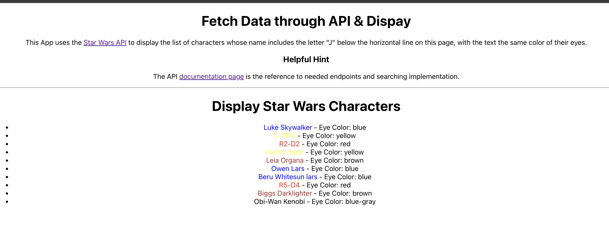

# Star Wars Characters App

## Table of Contents
- [Introduction](#introduction)
- [Features](#features)
- [Installation](#installation)

## Introduction

This application utilizes the [Star Wars API](https://swapi.dev) to fetch and display character data. The application is built using React and it displays a list of characters whose names include the letter "J". The text color of the characters' names is set to match their eye color.

- Reference Image
  

## Features

- Fetches character data from the Star Wars API.
- Displays a list of characters whose names include the letter "J".
- Colors the character names based on their eye color.

## Installation

### Prerequisites

Make sure you have the following installed:
- Node.js
- npm

### Clone the Repository

```bash
git clone https://github.com/blake-shahid/swapi-api-react.git
cd swapi-api-react
```

### Install Dependencies
```
npm install
```

### Start App
```
npm start
```
- Open your browser and navigate to http://localhost:3000 to see the app in action.
